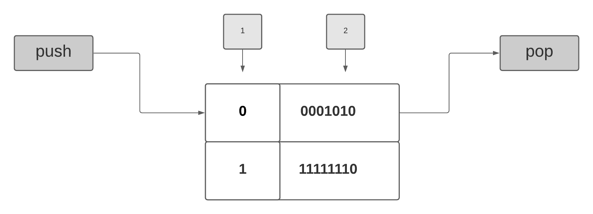

# Stack



## Help

for usage stack create obj `__stack stack(2)` and allocate 2 

for stack up `stack_push(0x15)` 

for unstack `stack_pop()` 

for get bit significative `stack_sign()`

for get size stack `stack_size()`

for verify stack empty `stack_empty()` return bool


> example

```C++

  __stack stack(2);

  stack.push(0x15);
  printf("pop=%u\n", stack.stack_pop());

```

## Notes 

> lib stack in process

> based in stack intel 8080

> to add data to the stack of 2 allocation is required, first significant data and second 8 bit least significant data

> int type stack support